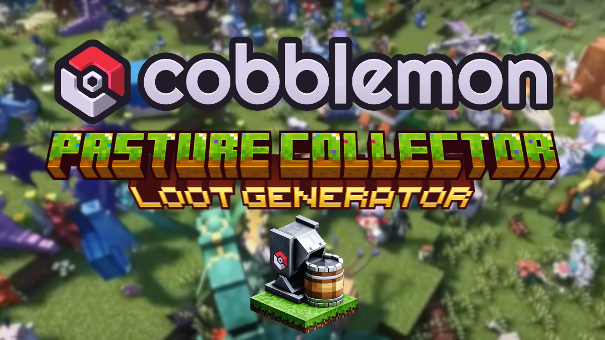

# Cobblemon Pasture Loot Generator



This script generates loot tables in `.json` format for Minecraft from `.csv` raw data. It is designed for the [Cobblemon Pasture Collector](https://modrinth.com/mod/cobblemon-pasturecollector) mod. This project is a datapack for the mod and does nothing by itself.

## What It Does

The Cobblemon Pasture Loot Generator reads data from CSV files and creates corresponding JSON files for Minecraft loot tables. It processes Pokémon drops and assigns item IDs based on a predefined dictionary, ensuring that the generated loot tables are accurate and consistent.

## How to Use the Script

### Prerequisites

1. **Install Visual Studio Code (VS Code)**:
   - Download and install VS Code from [here](https://code.visualstudio.com/).

2. **Install Python**:
   - Download and install Python from [here](https://www.python.org/downloads/).

3. **Install Jupyter Notebook Extension for VS Code**:
   - Open VS Code.
   - Go to the Extensions view by clicking the Extensions icon in the Activity Bar on the side of the window or by pressing `Ctrl+Shift+X`.
   - Search for "Jupyter" and install the Jupyter extension.

### Setting Up the Environment

1. **Clone the Repository**:
   - Clone the repository to your local machine using the following command:
     ```sh
     git clone https://github.com/porkyoot/pasturecollector.git
     ```

2. **Navigate to the Project Directory**:
   - Open a terminal and navigate to the project directory:
     ```sh
     cd pasturecollector
     ```

3. **Install Required Libraries**:
   - Run the following commands to install the required libraries:
     ```sh
     pip install --upgrade pip
     pip install jupyter pandas
     ```

### Running the Script

1. **Set the BLACKLIST Environment Variable**:
   - Before running the script, set the `BLACKLIST` environment variable to "true" to enable the blacklist functionality:
     ```sh
     set BLACKLIST=true
     ```

2. **Open the Jupyter Notebook**:
   - Open the `gen.ipynb` file in VS Code.

3. **Run the Cells**:
   - Run each cell in the notebook sequentially to execute the script. This will read the CSV files and generate the corresponding JSON files in the specified output directory.

### CSV File Structure

- **drops.csv**: Contains the Pokémon drops data.
- **rolls.csv**: Contains the rarity chances data.
- **cobblemon_items.csv**: Contains the Cobblemon items data.
- **minecraft_items.csv**: Contains the Minecraft items data.
- **blacklist.csv**: Contains the list of items to be blacklisted.

### Blacklist

The script includes a blacklist of items that should not be included in the generated loot tables. If an item is found in the blacklist, it will be skipped, and a warning message will be printed. This ensures that certain items are excluded from the loot tables as needed. To enable the blacklist functionality, set the `BLACKLIST` environment variable to "true" before running the script.

### Output

The generated JSON files will be saved in the `data/pasturecollector/loot_tables/gameplay/pasture_collector/species/` directory.

## License

This project is licensed under the MIT License. See the [LICENSE](LICENSE.md) file for details.

## Acknowledgements

- [Cobblemon Pasture Collector](https://modrinth.com/mod/cobblemon-pasturecollector) mod for providing the awesome mod that this project is based on.
- @Hellrqiser for the idea, the data and the tests
- @porkyoot for the scripts, logos and release